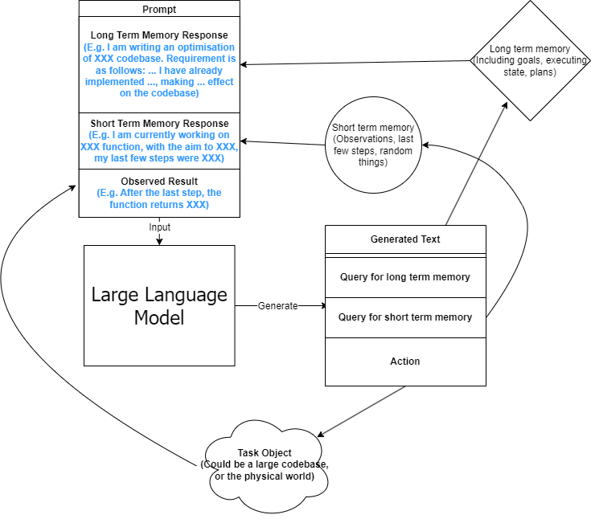

# BZA: A GPT-Powered Conversational Read Eval Print Loop for Books, Articles & Webpages (WIP)

Interactive books. Books sliced up like pizza. Book pizza. Bza.

It takes a pdf, or in the future maybe webpages or epubs, and feeds it a few pages at a time into chatgpt or similar, then outputs something, for example, a quiz on the topic of the pages it read and then waits for some form of user input to tell it to, for example, continue on or grade the quiz results, and maybe then tell a joke or make a short story about it, if feeling adventurous.

Thus it enables more activel reading, while also keeping bookmarks for you. (along with a bunch of other infromation as well, by logging the conversation onto the file system it could facilitate spaced repetition of read content).

Could also be thought of as a reading buddy, summarizer or a customizable narrator/reteller. 

## To Run
- if windows then install windows subsystem for linux 
- install [the nix package manager](https://nixos.org/download.html) (select appropriate operating system from sidebar)
- install [Git](https://git-scm.com/book/en/v2/Getting-Started-Installing-Git)
- `git clone https://github.com/NotBrianZach/bzabook2aquiz.git`
- `cd bzabook2aquiz`
- `nix-shell`
- `npm install`
- get $OPENAI_API_KEY key [here](https://platform.openai.com/account/api-keys) if u dont have 
- `OPENAI_API_KEY=$OPENAI_API_KEY ./bza.mjs -f path_2_ur_pdf_here.pdf`
- open an issue detailing why doesnt work
- ELITE HACKER: possibly move readingList.json && logs directory into another directory under source control or cloud backup and create a symlink(s) here (under bzabook2aquiz directory) pointing to it/them

## Event Loop Setup: 
0. - IF readingList.json has an entry for bookName, load title & synopsis & rollingSummary from there
   - ELSE prompt user for title&synopsis, and get pageNumber&chunkSize from commandline params or defaults (0,2)
     - you can, for example, have gpt make a synopsis for you by copy pasting abstract or table of contents into e.g. openai playground and prompting it to summarize said abstract or table of contents
   - finally initialize rollingSummary="this is the start of the document"
## Event Loop: Giving Gpt3 Short & Long Term Memory 
pageChunk = pages[pageNumber:pageNumber+chunkSize]
1. pageChunkSummary=queryGPT(summarize pageChunk given title+synopsis+rollingSummary)
2. Query User, act on input 
3. rollingSummary=queryGPT3(further contextualize pageChunk with respect to rest of book, this will act as a summary of previous pages for next pageChunk)
4. WHILE (pageNumber < bookLength), set pageNumber=pageNumber+chunkSize, jump back to 1. else continue to 5.
5. parting thoughts from gpt3, call onExit method (cleanup)

## Query User:
- c="continue" to next pageChunk,
- j="jump" to user input pageNumber,
- X="eXit" exit program, saving logs
- ASK user for input
  - r="repeat" ask user for input, then append to prompt and query gpt, 
  - R="Restart" restart conversation w/only initial prompt
- EVENT LOOP MODIFICATON TOGGLES
  - q="quiz" quiz loop (step 2.a. in Event Loop, prior to Query User, after summaries):
    -  query gpt3 to generate quiz, print quiz, query user for answers
    -  query gpt3 for "grade", explain "wrong" answers
    -  record a log of the quiz&answer
    -  Query User
- TOGGLEs print to console, and enable/disable printing in event loop
  - h="help" query options
  - s="summary of page chunk" gpt summary of the last chunk of pages
  - S="rolling Summary" gpt summary of everything up to this point (short term memory)
  - N= "Narration" rewrite all output in the voice of a character
  - V= TODO "Voice output" use ?[TTS](https://github.com/coqui-ai/TTS)? to generate voice to narrate gpt response & queries to user
  - v= TODO "voice input"  use ?talon? to allow voice input
- MODIFY LLM PROMPT: change all non-summary llm queries going forward
  - b="before" prepend next user query input
    - "tell a joke about the following text:" 
  - d=delete stack of prepended prompts
  - A="After" append next user query input to all non summary gpt requests
    - "...tell another joke about the above text that ties into the first joke" 
  - D="Delete" stack of appended prompts
  - l="length" change response length/max token count (default 2000, max = 4096 includes prompt)

## Options & Defaults (readingList.json): 
- Article format: [pdf, TODO html, TODO epub]
- Article Type: [book, research paper, news]

## Reading List Utility (bzaUtil.sh)
- store path to pdf and relevant executable to read it
- backup & rotate logs
- restore from logs

## Design Decisions
pdf-extract introduces a bunch of binary dependencies relative to alternative libraries but we want those because they enable optical character recognition on the subset of pdfs that are just scans of images (and I am guessing they are fast hopefully).

Also it would be nice to use other binary dependencies that can read pdfs or other types of file from the command line (and have the option to pass in e.g. the current pagenumber).

## Naming
The naive/correct pronounciation sounds like pizza, which is typically sliced into pieces just like we are chunking up books. Book pizza. 

bza is also my initials. #branding

and bza is a short three letter word which is not too overloaded and can be invoked easily on the command line.

Finally, book starts with B, quiz ends with Z and A is A. So it's like an anagram of some of the letters. 

Makes total sense. 

## Inspiration

i have kept, for a couple years, a reading list with commands like

"""

0-
ebook-viewer ~/media/books/TheDividedSelf2010.epub --open-at 59

0-
xpdf ~/media/books/tcp_ip_networkadministration_3rdedition.pdf 50 -z 200

xpdf ~/media/books/LinuxProgrammingInterface2010.pdf

"""

in a file in my /home/$user/media directory so i could read books from command line and record current position

i had also been looking for technically inclined book club without luck (well i didnt try super hard) 

a thought had been bubbling in my head that I wanted to read books alongside gpt3,

i had previously spent quite some time trying to make multi player choose your own adventure novels a thing (TODO make it so you can talk to multiple different llms or prompts at once or share a repl session with your buddy or something TODO)

i really thought, and think, as a massive wordcel, that computers have a vast potential to create new narrative structures

then i saw this reddit post

https://www.reddit.com/r/singularity/comments/11ho23y/first_post_in_reddit_mistakely_used_a_text_post/

and a within a couple minutes, after some good ole reddit arguing, i started writing this

## Pushdown Large Language Models

a final thought, about fundamental models of computation

the theoretical taxonomy of computation looks like this

finite state machines -> have subset of functionality of -> context free grammars -> have subset of functionality of -> turing machines

traditional narratives are simple finite state machines at the level of pages

most choose your own adventure novels are also finite state machines, though they have a bit more structure since they are not purely sequential

the way I wanted to implement multiplayer choose your own adventure novels,

i believe they would have been more akin to a push down automata, or context free grammar,

since the story would maintain a list of invalidated edges (which could also be thought of as a unique class of "intermediate" node that dont branch),

and transitions between nodes could change the choices available to other players

i think there is a similar analogy going on here.

reddit user SignificanceMassive3's diagram displays a "context free" or "pushdown" large language model (ignore the fact the diagram has two stacks and is ?probably? technically turing complete, we don't push to our long term context after we define it, well, mostly... Look buddy we are operationally a pushdown automata!)

which, much like a regular expression is suitable for matching patterns in text, a "push down llm" is suitable for the task of reading along with longer form text 
